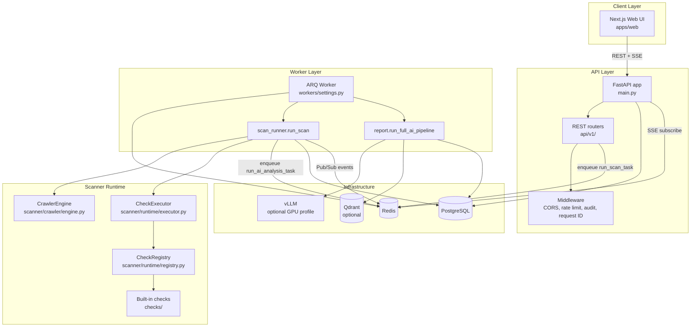
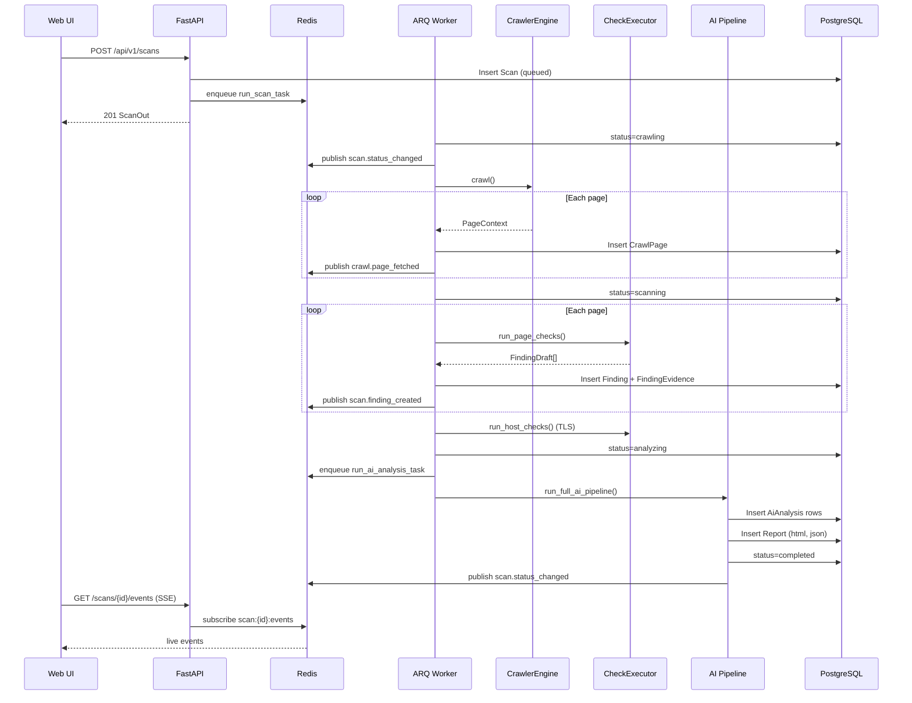
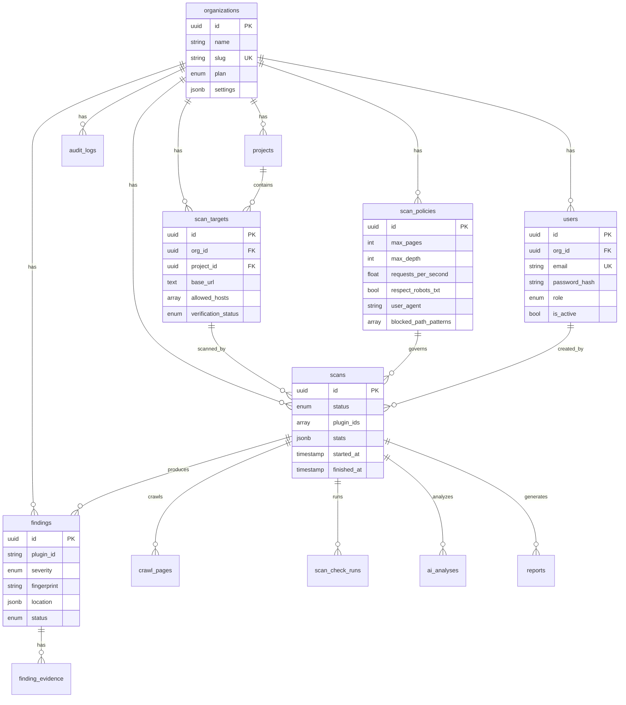
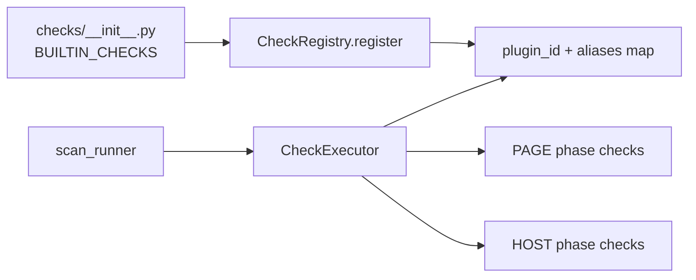

# OrchestraSecAI — System Overview

> **Scope:** This document describes OrchestraSecAI **as implemented today** (MVP v0.1.0). It is derived from the codebase under `orchestrasecai/`, not from roadmap documents.

OrchestraSecAI is a **passive web security scanner**: it crawls authorized targets with GET-only HTTP requests, runs built-in security checks, optionally enriches results with AI analysis, and exposes findings and reports through a REST API and Next.js dashboard.

Related docs:

- [architecture.md](./architecture.md) — high-level layer summary
- [passive-only-policy.md](./passive-only-policy.md) — passive scanning policy
- [threat-model.md](./threat-model.md) — SSRF and abuse considerations

---

## Table of Contents

1. [Executive Summary](#executive-summary)
2. [Architecture](#architecture)
3. [Tech Stack](#tech-stack)
4. [Repository Layout](#repository-layout)
5. [Runtime Components](#runtime-components)
6. [Scan Lifecycle & Data Flow](#scan-lifecycle--data-flow)
7. [Database Schema](#database-schema)
8. [REST API](#rest-api)
9. [Authentication & RBAC](#authentication--rbac)
10. [Scanner & Crawler](#scanner--crawler)
11. [Plugin System & Built-in Checks](#plugin-system--built-in-checks)
12. [Workers (ARQ)](#workers-arq)
13. [AI Pipeline & Reports](#ai-pipeline--reports)
14. [Frontend (Next.js)](#frontend-nextjs)
15. [Docker & Deployment](#docker--deployment)
16. [Environment Variables](#environment-variables)
17. [Security Controls](#security-controls)
18. [Seed Data](#seed-data)
19. [Known Limitations & MVP Shortcuts](#known-limitations--mvp-shortcuts)

---

## Executive Summary

| Aspect | Current state |
|--------|---------------|
| **Pattern** | Modular monolith: FastAPI API + ARQ worker processes share one Python package |
| **Scan model** | Passive crawl → page/host checks → AI analysis → HTML/JSON reports |
| **Checks** | 4 built-in plugins: `header`, `cookie`, `tls`, `disclosure` |
| **Auth** | JWT (access + refresh), Argon2 password hashing, org-scoped RBAC |
| **Queue** | Redis + ARQ (`run_scan_task`, `run_ai_analysis_task`) |
| **Realtime** | Redis Pub/Sub → SSE stream at `/api/v1/scans/{id}/events` |
| **AI default** | `MOCK_AI=true` — canned JSON without GPU |
| **Multi-tenant** | Single org seeded by default; org switcher stub behind feature flag |

---

## Architecture

OrchestraSecAI splits into an **API process** (HTTP + enqueue) and a **worker process** (crawl, scan, AI). Both import the same Python package at `apps/api/src/orchestrasecai/`.



**Startup (`main.py`):**

1. `build_registry()` — registers all built-in check plugins.
2. `run_seed()` — creates default org, admin user, policy, and project if the DB is empty.
3. Middleware stack: CORS → `RequestIdMiddleware` → `RateLimitMiddleware` → `AuditMiddleware`.
4. Router mounted at `/api/v1`.

---

## Tech Stack

| Layer | Technology | Location |
|-------|------------|----------|
| API | Python 3.12, FastAPI 0.115+, Uvicorn | `apps/api/` |
| ORM | SQLAlchemy 2 (async), asyncpg | `persistence/` |
| Migrations | Alembic | `apps/api/alembic/` |
| Auth | python-jose (JWT), argon2-cffi | `security/auth.py` |
| HTTP client (crawler) | httpx | `scanner/crawler/engine.py` |
| Job queue | ARQ 0.26+, Redis 7 | `workers/` |
| AI | httpx → OpenAI-compatible `/chat/completions`, YAML prompts, Jinja2 | `ai/` |
| Embeddings (optional) | SHA256-derived vectors + Qdrant | `ai/embeddings.py` |
| Web UI | Next.js 14, React 18, Tailwind CSS | `apps/web/` |
| Database | PostgreSQL 16 | Docker / local |
| CI | GitHub Actions (ruff, pytest, eslint, build) | `.github/workflows/ci.yml` |

---

## Repository Layout

```
orchestrasecai/
├── apps/
│   ├── api/
│   │   ├── src/orchestrasecai/     # Main Python package
│   │   │   ├── main.py             # FastAPI entrypoint
│   │   │   ├── config.py           # Pydantic settings
│   │   │   ├── api/                # REST layer
│   │   │   │   ├── v1/             # Route modules
│   │   │   │   ├── deps.py         # Auth dependencies
│   │   │   │   ├── schemas.py      # Pydantic DTOs
│   │   │   │   ├── middleware/     # Rate limit, audit, request ID
│   │   │   │   └── services/audit.py
│   │   │   ├── checks/             # Built-in security plugins
│   │   │   ├── scanner/            # Crawler + plugin runtime
│   │   │   ├── domain/             # Business logic (scan runner, verification stub)
│   │   │   ├── workers/            # ARQ task definitions
│   │   │   ├── ai/                 # LLM client, prompts, report pipeline
│   │   │   ├── security/           # SSRF, passive HTTP, RBAC, auth
│   │   │   └── persistence/        # SQLAlchemy models, seed, session
│   │   ├── alembic/                # DB migrations
│   │   └── tests/
│   └── web/                        # Next.js dashboard
│       └── src/
│           ├── app/                # App Router pages
│           ├── components/
│           ├── hooks/useScanEvents.ts
│           └── lib/api.ts
├── packages/check-sdk/             # Stub README for future plugin SDK
├── docker/                         # Dockerfiles + compose files
├── docs/                           # Architecture, threat model, this doc
├── .env.example
└── README.md
```

---

## Runtime Components

### API server

- **Module:** `orchestrasecai.main:app`
- **Command:** `uvicorn orchestrasecai.main:app --host 0.0.0.0 --port 8000`
- **Responsibilities:** Authentication, CRUD for org resources, scan creation (enqueue only), SSE event streaming, report download.

### ARQ worker

- **Module:** `orchestrasecai.workers.settings.WorkerSettings`
- **Command:** `arq orchestrasecai.workers.settings.WorkerSettings`
- **Jobs:**
  - `run_scan_task` → `domain/services/scan_runner.run_scan`
  - `run_ai_analysis_task` → `ai/pipelines/report.run_full_ai_pipeline`
- **Settings:** `max_jobs = WORKER_CONCURRENCY` (default 2), `job_timeout = SCAN_GLOBAL_TIMEOUT_SECONDS` (default 1800s).

### Migrate job (Docker only)

One-shot Alembic container runs `alembic upgrade head` before API and worker start.

---

## Scan Lifecycle & Data Flow

### Status machine

Defined in `persistence/tables/core.py` as `ScanStatus`:

| Status | Set by | Meaning |
|--------|--------|---------|
| `queued` | API on scan create | Job enqueued, not started |
| `crawling` | `scan_runner` | Crawler fetching pages |
| `scanning` | `scan_runner` | Checks running on crawled pages + host |
| `analyzing` | `scan_runner` | AI job enqueued |
| `completed` | `run_full_ai_pipeline` | Reports persisted |
| `failed` | `scan_runner` (missing target/policy) | Terminal error |
| `cancelled` | *(enum only)* | Crawler supports cancel check; **no API to set this** |



### Event channel

- **Publisher:** `scan_runner.publish_event()` and `run_full_ai_pipeline()` via `redis.publish`.
- **Channel:** `scan:{scan_id}:events`
- **Payload:** JSON with `"event"` key plus event-specific fields.
- **Event types today:** `scan.status_changed`, `crawl.page_fetched`, `scan.finding_created`, `ai.analysis_completed`.

### Finding deduplication

Findings are deduplicated per scan by `fingerprint` (SHA256-derived, 32-char hex). Unique constraint: `(scan_id, fingerprint)`.

---

## Database Schema

ORM models live in `persistence/tables/core.py` and `persistence/tables/audit.py`. Initial migration: `alembic/versions/001_initial_schema.py`.



### Table reference

| Table | Model | Purpose |
|-------|-------|---------|
| `organizations` | `Organization` | Tenant container (`slug`, `plan`, `settings`) |
| `users` | `User` | Login identity, `role`, org membership |
| `projects` | `Project` | Grouping for scan targets |
| `scan_targets` | `ScanTarget` | Base URL, allowed hosts, verification status |
| `scan_policies` | `ScanPolicy` | Crawl limits and behavior |
| `scans` | `Scan` | Scan job record and stats |
| `crawl_pages` | `CrawlPage` | Per-URL crawl snapshot (headers, snippet) |
| `scan_check_runs` | `ScanCheckRun` | Per-check execution metrics (one row per page/host iteration) |
| `findings` | `Finding` | Normalized vulnerability/issue records |
| `finding_evidence` | `FindingEvidence` | Typed evidence payloads (HTTP, TLS) |
| `ai_analyses` | `AiAnalysis` | LLM output per analysis type |
| `reports` | `Report` | Generated HTML/JSON report content |
| `audit_logs` | `AuditLog` | Security audit trail |

### Enums (`core.py`)

- **PlanType:** `free`, `pro`
- **UserRole:** `owner`, `admin`, `analyst`, `viewer`
- **VerificationStatus:** `unverified`, `pending`, `verified`
- **ScanStatus:** see lifecycle above
- **Severity:** `info`, `low`, `medium`, `high`
- **FindingStatus:** `open`, `accepted_risk`, `false_positive`
- **ReportFormat:** `json`, `html`, `pdf` *(PDF not generated today)*

---

## REST API

Base path: **`/api/v1`**. OpenAPI: `/api/v1/openapi.json`.

All routes except health require `Authorization: Bearer <access_token>` unless noted.

### Health

| Method | Path | Auth | Description |
|--------|------|------|-------------|
| GET | `/health` | No | `{"status": "ok"}` |
| GET | `/ready` | No | DB + Redis connectivity check |

### Auth (`api/v1/auth.py`)

| Method | Path | Description |
|--------|------|-------------|
| POST | `/auth/login` | Email/password → access + refresh tokens; writes audit log |
| POST | `/auth/refresh` | Refresh token → new token pair |
| GET | `/me` | Current user + org summary *(also registered at router level)* |

### Organizations (`api/v1/orgs.py`)

| Method | Path | Description |
|--------|------|-------------|
| GET | `/orgs/current` | Returns `org_id`, `multi_tenant_enabled` flag |
| GET | `/orgs` | Returns 404 unless `MULTI_TENANT_ENABLED=true` (returns empty list) |

### Projects (`api/v1/projects.py`)

| Method | Path | Permission | Description |
|--------|------|------------|-------------|
| GET | `/projects` | `projects:read` | List org projects |
| POST | `/projects` | `projects:write` | Create project |
| GET | `/projects/{id}` | `projects:read` | Get project |

### Targets (`api/v1/targets.py`)

| Method | Path | Permission | Description |
|--------|------|------------|-------------|
| GET | `/targets` | `targets:read` | List scan targets |
| POST | `/targets` | `targets:write` | Create target; SSRF validation on `base_url` |

### Scan policies (`api/v1/policies.py`)

| Method | Path | Permission | Description |
|--------|------|------------|-------------|
| GET | `/scan-policies` | `policies:read` | List policies |
| POST | `/scan-policies` | `policies:write` | Create policy |
| GET | `/scan-policies/{id}` | `policies:read` | Get policy |

### Scans (`api/v1/scans.py`)

| Method | Path | Permission | Description |
|--------|------|------------|-------------|
| GET | `/scans` | `scans:read` | List scans (limit 50, optional `?status=`) |
| POST | `/scans` | `scans:write` | Create scan, enqueue `run_scan_task` |
| GET | `/scans/{id}` | `scans:read` | Scan status and stats |
| GET | `/scans/{id}/pages` | `scans:read` | Crawled page summaries |
| GET | `/scans/{id}/findings` | `scans:read` | Findings (optional `?severity=`) |
| POST | `/scans/{id}/analyze` | `scans:write` | Re-enqueue AI analysis |
| GET | `/scans/{id}/events` | `scans:read` | SSE stream (Server-Sent Events) |

### Findings (`api/v1/findings.py`)

| Method | Path | Permission | Description |
|--------|------|------------|-------------|
| PATCH | `/findings/{id}` | `findings:write` | Update finding status |

### Reports (`api/v1/reports.py`)

| Method | Path | Permission | Description |
|--------|------|------------|-------------|
| GET | `/scans/{id}/report?format=html\|json` | `reports:read` | Latest report content |

### Request/response schemas

Defined in `api/schemas.py`: `ScanCreate`, `ScanOut`, `TargetCreate`, `PolicyCreate`, `FindingOut`, `FindingPatch`, etc.

Default scan plugins if omitted:

```python
["header", "cookie", "tls", "disclosure"]
```

---

## Authentication & RBAC

### JWT tokens (`security/auth.py`)

| Token | Claims | Expiry (default) |
|-------|--------|-------------------|
| Access | `sub`, `org_id`, `role`, `type=access` | 15 minutes (`JWT_ACCESS_EXPIRE_MINUTES`) |
| Refresh | `sub`, `type=refresh` | 7 days (`JWT_REFRESH_EXPIRE_DAYS`) |

Algorithm: **HS256** with `JWT_SECRET`. Passwords hashed with **Argon2** (`argon2-cffi`).

### Dependency injection (`api/deps.py`)

- `get_current_user` — validates Bearer token, loads active user, returns `UserOut`.
- `require_perm("permission")` — checks RBAC and returns user or 403.

### Role permissions (`security/rbac.py`)

| Permission | owner | admin | analyst | viewer |
|------------|:-----:|:-----:|:-------:|:------:|
| `scans:read/write` | ✓/✓ | ✓/✓ | ✓/✓ | ✓/— |
| `targets:read/write` | ✓/✓ | ✓/✓ | ✓/— | ✓/— |
| `projects:read/write` | ✓/✓ | ✓/✓ | ✓/— | ✓/— |
| `policies:read/write` | ✓/✓ | ✓/✓ | ✓/— | ✓/— |
| `findings:write` | ✓ | ✓ | ✓ | — |
| `reports:read` | ✓ | ✓ | ✓ | ✓ |
| `org:read/write` | ✓/✓ | ✓/— | —/— | —/— |
| `users:read/write` | ✓/✓ | ✓/✓ | —/— | —/— |

### Org isolation

All resource queries filter by `user.org_id` from the JWT-derived user. Cross-org access returns 404.

### Audit logging

Explicit audit writes via `api/services/audit.log_audit()` on:

- `auth.login`
- `scan.create`

`AuditMiddleware` sets `request.state.audit_pending` on mutating `/api/v1` requests but **does not persist** those entries automatically.

---

## Scanner & Crawler

### CrawlerEngine (`scanner/crawler/engine.py`)

Breadth-first crawler using an internal `deque` queue (note: `scanner/crawler/frontier.py` defines an unused `Frontier` class).

**Configuration** (from `ScanPolicy` + target):

| Parameter | Default | Source field |
|-----------|---------|--------------|
| `max_pages` | 50 | `ScanPolicy.max_pages` |
| `max_depth` | 3 | `ScanPolicy.max_depth` |
| `requests_per_second` | 2.0 | `ScanPolicy.requests_per_second` |
| `respect_robots` | true | `ScanPolicy.respect_robots_txt` |
| `user_agent` | `OrchestraSecAI-Scanner/0.1 (+https://orchestrasec.ai)` | `ScanPolicy.user_agent` |
| `blocked_patterns` | `[]` | `ScanPolicy.blocked_path_patterns` |

**Behavior:**

1. Validates base URL via SSRF guard before crawl.
2. Asserts passive GET at crawl start (`assert_passive_method("GET")`).
3. Fetches `robots.txt` via `RobotsCache` (`scanner/crawler/robots.py`); allows all on failure.
4. Rate-limits with token-bucket-style `RateLimiter`.
5. For each URL: scope check → robots check → `httpx GET` with redirects.
6. Stores up to 8 KB body snippet for `text/*` responses; extracts links from HTML via regex.
7. Parses `Set-Cookie` headers into structured cookie objects for the cookie check.

### Scope rules (`scanner/crawler/scope.py`)

- **URL normalization:** lowercase host, default path `/`.
- **In-scope:** same registrable domain as base URL, unless `allowed_hosts` overrides.
- **Blocked paths:** substring match against `blocked_path_patterns`.
- **Link extraction:** `href` attributes; skips `mailto:`, `javascript:`, `#`, `tel:`.

### Passive-only enforcement

`security/passive_http.py` allows only **GET** and **HEAD**. The crawler uses GET exclusively. Robots fetch also asserts GET.

---

## Plugin System & Built-in Checks

### Architecture



**Base types:** `checks/base.py`

- `SecurityCheck` — abstract plugin with `plugin_id`, `name`, `phase`, `run(ctx)`.
- `CheckPhase` — `PAGE`, `HOST`, `SCAN` *(no checks use `SCAN` today)*.
- `CheckContext` — scan/org IDs plus optional `PageContext` or `HostContext`.
- `FindingDraft` — pre-persistence finding with fingerprint and evidence list.

**Registry:** `scanner/runtime/registry.py`

- `build_registry()` instantiates each class in `BUILTIN_CHECKS`.
- Registers by `plugin_id` and `aliases`.

**Executor:** `scanner/runtime/executor.py`

- `run_page_checks()` — filters `CheckPhase.PAGE`, captures timing metrics.
- `run_host_checks()` — filters `CheckPhase.HOST` (TLS only).
- Failures per check are caught; metrics record `status=failed` and error message.

**Future SDK:** `packages/check-sdk/README.md` is a stub; MVP plugins live in `checks/` directly.

### Check 1: Header (`checks/header_check.py`)

- **Phase:** PAGE
- **Plugin ID:** `header`
- **Logic:** Flags missing security headers on each crawled response:
  - `Strict-Transport-Security` → `header.missing_strict_transport_security` (medium)
  - `Content-Security-Policy` → `header.missing_content_security_policy` (medium)
  - `X-Frame-Options` → `header.missing_x_frame_options` (low)
  - `X-Content-Type-Options` → `header.missing_x_content_type_options` (low)
  - `Referrer-Policy` → `header.missing_referrer_policy` (info)

### Check 2: Cookie (`checks/cookie_check.py`)

- **Phase:** PAGE
- **Plugin ID:** `cookie`
- **Logic:** For each parsed cookie, reports missing:
  - `Secure` → `cookie.missing_secure` (medium)
  - `HttpOnly` → `cookie.missing_httponly` (medium)
  - `SameSite` → `cookie.missing_samesite` (low)

### Check 3: TLS (`checks/tls_check.py`)

- **Phase:** HOST (once per scan, not per page)
- **Plugin ID:** `tls`
- **Logic:**
  - Opens TCP 443 + TLS handshake via `ssl.create_default_context()`.
  - **Weak protocol:** SSLv2/v3, TLSv1, TLSv1.1 → `tls.weak_protocol` (high).
  - **Cert expiry:** &lt; 30 days → `tls.cert_expiring` (medium if &gt; 7 days, high if ≤ 7).

### Check 4: Disclosure (`checks/disclosure_check.py`)

- **Phase:** PAGE
- **Plugin ID:** `disclosure`
- **Logic:**
  - Debug/banner headers (`X-Debug`, `X-Debug-Token`, `Server`) → `disclosure.debug_header` (low).
  - Email regex in body (max 3) → `disclosure.email_in_body` (info).
  - API key/secret pattern in body → `disclosure.possible_api_key` (high).

---

## Workers (ARQ)

### Configuration (`workers/settings.py`)

```python
class WorkerSettings:
    redis_settings = RedisSettings.from_dsn(settings.redis_url)
    functions = [run_scan_task, run_ai_analysis_task]
    max_jobs = settings.worker_concurrency      # default 2
    job_timeout = settings.scan_global_timeout_seconds  # default 1800
```

### Task: `run_scan_task` (`workers/tasks/scan.py`)

Thin wrapper calling `run_scan(scan_id)`. Creates its own async DB engine/session (separate from API session pool).

### Task: `run_ai_analysis_task` (`workers/tasks/ai.py`)

Calls `run_full_ai_pipeline(scan_id)`.

### Job chaining

`run_scan` enqueues AI analysis automatically when crawling and checking finish. The API can also trigger re-analysis via `POST /scans/{id}/analyze`.

---

## AI Pipeline & Reports

### Active pipeline

**Entry:** `ai/pipelines/report.py` → `run_full_ai_pipeline(scan_id)`

**Steps:**

1. Load scan + all findings from DB.
2. For each finding (if `QDRANT_ENABLED`):
   - Upsert SHA256-based embedding to Qdrant collection `findings`.
   - Attach `similar_findings` to finding `location` JSON.
3. Run four LLM prompts sequentially via `LLMClient.complete()`:
   - `explain` — `ai/prompts/explain/v1.yaml`
   - `prioritize` — `ai/prompts/prioritize/v1.yaml`
   - `executive_summary` — `ai/prompts/executive_summary/v1.yaml`
   - `technical_report` — `ai/prompts/technical_report/v1.yaml`
4. Persist each result to `ai_analyses` table; publish `ai.analysis_completed` events.
5. Generate inline HTML report (f-string template in `_render_html_report`) and JSON report blob.
6. Insert `reports` rows (`format=html`, `format=json`).
7. Set scan `status=completed`, `finished_at=now()`, publish `scan.status_changed`.

### LLM client (`ai/client.py`)

| Mode | Behavior |
|------|----------|
| `MOCK_AI=true` (default) | Returns heuristic canned JSON based on prompt keywords |
| `MOCK_AI=false` | POST to `{VLLM_BASE_URL}/chat/completions` with `VLLM_MODEL` |

Prompts loaded from YAML under `ai/prompts/{name}/v1.yaml`. User templates rendered with Jinja2.

### Report delivery

- **API:** `GET /api/v1/scans/{id}/report?format=html|json`
- **Storage:** Report content stored in PostgreSQL `reports.content` (text column).
- **PDF:** Enum exists; no PDF generation implemented.
- **Template file:** `ai/templates/report.html.j2` exists but the active pipeline uses inline HTML in `report.py`.

### Unused / legacy AI modules

These files exist but are **not wired** into the worker pipeline:

- `ai/pipelines/explain.py` — imports non-existent `chat_completion`, `similar_findings`
- `ai/pipelines/prioritize.py` — imports non-existent `chat_completion`
- `ai/prompts/loader.py` — alternate prompt loader (used only by unused pipelines)
- `domain/models/scan.py`, `scanner/runtime/context.py` — parallel type definitions superseded by `checks/base.py`

---

## Frontend (Next.js)

**App:** `apps/web/` — Next.js 14 App Router, client-side auth via `localStorage`.

### Pages

| Route | File | Purpose |
|-------|------|---------|
| `/` | `app/page.tsx` | Redirects to `/login` |
| `/login` | `app/login/page.tsx` | Email/password login (pre-filled seed credentials) |
| `/dashboard` | `app/dashboard/page.tsx` | Welcome + quick start; checks multi-tenant flag |
| `/targets` | `app/targets/page.tsx` | List/create scan targets |
| `/scans` | `app/scans/page.tsx` | List scans, start new scan |
| `/scans/[id]` | `app/scans/[id]/page.tsx` | Scan detail, live events, findings, report link |

### Layout

`components/layout/DashboardShell.tsx` — top nav (Dashboard, Targets, Scans), logout, passive-scan footer warning.

### API client (`lib/api.ts`)

- Base URL: `NEXT_PUBLIC_API_URL` (default `http://localhost:8000`).
- Attaches `Authorization: Bearer` from `localStorage.access_token`.
- `login()` stores access + refresh tokens.

### Real-time events (`hooks/useScanEvents.ts`)

Uses **fetch streaming** (not native `EventSource`) because SSE requires Authorization header. Parses SSE frames from `GET /scans/{id}/events`.

### Report viewing caveat

Scan detail opens report URL in a new tab **without** attaching the JWT. Report endpoint requires auth, so viewing may fail unless cookies or another auth mechanism is added.

---

## Docker & Deployment

### Production compose (`docker/compose/docker-compose.yml`)

| Service | Image / build | Ports | Role |
|---------|---------------|-------|------|
| `postgres` | postgres:16-alpine | internal | Database |
| `redis` | redis:7-alpine | internal | Queue + Pub/Sub |
| `qdrant` | qdrant/qdrant:v1.12.1 | internal | Vector store (unused unless enabled) |
| `migrate` | api.Dockerfile | — | `alembic upgrade head` |
| `api` | api.Dockerfile | **8000** | FastAPI |
| `worker` | worker.Dockerfile | — | ARQ worker |
| `web` | web.Dockerfile | **3000** | Next.js production build |

**Networks:** `backend` (data services), `frontend` (web ↔ api).

**Quick start:**

```bash
cd orchestrasecai
cp .env.example .env
docker compose -f docker/compose/docker-compose.yml up --build
```

### Dev compose overlay (`docker/compose/docker-compose.dev.yml`)

Adds hot reload for API (`uvicorn --reload`) and web (`npm run dev`) with source volume mounts.

### GPU profile (`docker/compose/docker-compose.gpu.yml`)

Optional `vllm` service (profile `gpu`) + sets `MOCK_AI=false`, `VLLM_BASE_URL=http://vllm:8000/v1` on api/worker.

### Dockerfiles

| File | Base | CMD |
|------|------|-----|
| `docker/api.Dockerfile` | python:3.12-slim | uvicorn |
| `docker/worker.Dockerfile` | python:3.12-slim | arq |
| `docker/web.Dockerfile` | node:20-alpine multi-stage | node server.js (standalone) |

---

## Environment Variables

From `.env.example` and `config.py`:

| Variable | Default | Purpose |
|----------|---------|---------|
| `DATABASE_URL` | `postgresql+asyncpg://...@postgres:5432/orchestrasecai` | Async SQLAlchemy URL |
| `DATABASE_URL_SYNC` | `postgresql://...@postgres:5432/orchestrasecai` | Alembic / sync operations |
| `REDIS_URL` | `redis://redis:6379/0` | ARQ + Pub/Sub |
| `JWT_SECRET` | `change-me-in-production-...` | HS256 signing key |
| `JWT_ACCESS_EXPIRE_MINUTES` | `15` | Access token TTL |
| `JWT_REFRESH_EXPIRE_DAYS` | `7` | Refresh token TTL |
| `API_HOST` / `API_PORT` | `0.0.0.0` / `8000` | Uvicorn bind (local dev) |
| `CORS_ORIGINS` | `http://localhost:3000,...` | Comma-separated allowed origins |
| `WORKER_CONCURRENCY` | `2` | ARQ `max_jobs` |
| `SCAN_GLOBAL_TIMEOUT_SECONDS` | `1800` | ARQ job timeout |
| `VLLM_BASE_URL` | `http://vllm:8000/v1` | OpenAI-compatible endpoint |
| `VLLM_MODEL` | `meta-llama/Llama-3.1-8B-Instruct` | Model name |
| `MOCK_AI` | `true` | Skip real LLM calls |
| `QDRANT_ENABLED` | `false` | Enable embedding similarity |
| `QDRANT_URL` | `http://qdrant:6333` | Qdrant HTTP API |
| `QDRANT_API_KEY` | *(empty)* | Optional Qdrant auth |
| `MULTI_TENANT_ENABLED` | `false` | Org switcher feature flag |
| `RATE_LIMIT_REQUESTS_PER_MINUTE` | `120` | Per-IP API rate limit |
| `RATE_LIMIT_SCANS_PER_DAY` | `50` | Per-org daily scan creation limit (Redis counter on `POST /scans`) |
| `RATE_LIMIT_FAIL_OPEN` | `true` | Allow traffic when Redis is unavailable |
| `TRUSTED_PROXY_DEPTH` | `0` | Parse `X-Forwarded-For` for client IP (0 = use socket peer) |
| `LOG_LEVEL` | `INFO` | Structlog JSON log level |
| `SENTRY_DSN` | *(empty)* | Optional Sentry error tracking |
| `OTEL_ENABLED` | `true` | OpenTelemetry tracing |
| `OTEL_EXPORTER_OTLP_ENDPOINT` | *(empty)* | OTLP gRPC exporter (empty = console spans in dev) |
| `SEED_ADMIN_EMAIL` | `admin@orchestrasec.local` | First-run admin |
| `SEED_ADMIN_PASSWORD` | `changeme123` | First-run password |
| `NEXT_PUBLIC_API_URL` | `http://localhost:8000` | Web → API base URL |

---

## Security Controls

### SSRF protection (`security/ssrf.py`)

Applied when creating targets and before each crawl request:

- Scheme must be `http` or `https`.
- Hostname resolved via `socket.getaddrinfo`.
- Blocks private, loopback, link-local, reserved IPs and explicit CIDR blocklist (RFC1918, `127.0.0.0/8`, `169.254.0.0/16`, IPv6 ULA/link-local).

**Note:** `validate_target_url()` raises FastAPI `HTTPException`. Some code paths reference a non-existent `SSRFError` exception class (see limitations).

### Passive-only policy

Documented in `docs/passive-only-policy.md`. Enforced in code via `assert_passive_method()` — only GET/HEAD allowed. Crawler uses GET only; no form submission, POST fuzzing, or active exploitation.

### Rate limiting (`api/middleware/rate_limit.py`)

Redis-backed distributed sliding-window rate limit on `/api/v1/*` paths. Uses a shared async Redis client from app lifespan (`main.py` → `app.state.redis`) and a sorted-set Lua script keyed by `rate_limit:ip:{client_ip}`. Default: 120 requests/minute (`RATE_LIMIT_REQUESTS_PER_MINUTE`). Returns HTTP 429 when exceeded. **Distributed** — counters are shared across API replicas via Redis.

Per-org daily scan cap enforced in `POST /api/v1/scans` via Redis `INCR` Lua script (`rate_limit:org:{org_id}:scans:{date}`).

On Redis connection failures, the middleware **fails open** by default (`RATE_LIMIT_FAIL_OPEN=true`); set to `false` to return HTTP 503. Lua scripts are registered at API startup for atomic cross-replica enforcement. Returns `X-RateLimit-*` and `Retry-After` headers on HTTP 429.

### Target verification (`domain/verification.py`)

Stub only:

- `can_scan_unverified_target()` always returns `True`.
- New targets default to `verification_status=unverified`.
- DNS TXT verification instructions returned by stub but not enforced.

### Observability

- **Structured logging:** structlog JSON on stdout; every line includes `request_id`, `org_id`, `scan_id` (null when unset).
- **Tracing:** OpenTelemetry on FastAPI routes and ARQ tasks; W3C trace context propagated through ARQ job kwargs (`otel_carrier`).
- **Metrics:** `GET /metrics` Prometheus endpoint (HTTP latency, rate-limit denials, ARQ job counters).
- **Errors:** Optional Sentry via `SENTRY_DSN`.

### Request tracing

`RequestIdMiddleware` propagates `X-Request-Id` (generates UUID if absent). Bound to structlog context and forwarded to ARQ workers via job metadata.

### Problem details

Unhandled exceptions with `status_code` attribute return RFC 7807-style JSON (`application/problem+json`) via global handler in `main.py`.

---

## Seed Data

**Module:** `persistence/seed.py` — runs once at API startup if no organization exists.

| Entity | Values |
|--------|--------|
| Organization | name=`Default Organization`, slug=`default`, plan=`free` |
| User | email=`SEED_ADMIN_EMAIL`, password=`SEED_ADMIN_PASSWORD`, role=`owner` |
| ScanPolicy | name=`Default Policy`, max_pages=50, max_depth=3 |
| Project | name=`Default Project`, description=`MVP default project` |

Default login (from `.env.example`):

- Email: `admin@orchestrasec.local`
- Password: `changeme123`

---

## Known Limitations & MVP Shortcuts

### Product / feature gaps

| Area | Current behavior |
|------|------------------|
| Domain verification | UI warning only; scans allowed on unverified targets |
| Scan cancellation | `ScanStatus.cancelled` exists; no API endpoint to cancel |
| Multi-tenant | Single seeded org; `/orgs` list disabled unless flag enabled |
| PDF reports | Enum only; not generated |
| Worker metrics HTTP | ARQ job counters logged; no separate worker `/metrics` port |
| User management API | RBAC defines `users:*` permissions; no user CRUD routes |
| Project/policy UI | No dedicated frontend pages; scans page uses first policy implicitly |
| Report auth in UI | HTML report opened without Bearer token |
| Finding triage UI | PATCH API exists; no UI to change finding status |
| Check metrics | `scan_check_runs` rows inserted per page iteration (can duplicate) |

### Code inconsistencies (as of this review)

| Issue | Details |
|-------|---------|
| `SSRFError` | Referenced in `targets.py` and tests; not defined in `ssrf.py` (uses `HTTPException` instead) |
| `CurrentUser` | `orgs.py` imports `CurrentUser` from `deps.py`; only `UserOut` is defined |
| Dead AI pipelines | `ai/pipelines/explain.py`, `prioritize.py` import missing symbols |
| Duplicate models | `domain/models/scan.py` vs `checks/base.py`; only后者 used in scan path |
| Unused crawler | `scanner/crawler/frontier.py` not used by `CrawlerEngine` |
| Audit middleware | Sets `audit_pending` state but does not write to `audit_logs` |
| Alembic vs ORM drift | Migration uses string columns for some enums; ORM uses PostgreSQL enums; `reports.storage_path` in migration but not in ORM model |
| TLS check | Probes port 443 only; no HTTP sites without TLS |
| Disclosure check | Regex-based; high false-positive rate for API key pattern |

### Operational notes

- Rate limiting uses **Redis** (shared across replicas); audit middleware state is still in-process only.
- Qdrant runs in Docker compose but is inactive unless `QDRANT_ENABLED=true`.
- Worker creates a new DB engine per job in `run_scan` / AI pipeline (no shared pool with API).
- `MOCK_AI=true` is the default — production AI requires GPU compose profile or external vLLM endpoint.

---

*Document generated from codebase review. Version aligned with `pyproject.toml` v0.1.0.*
